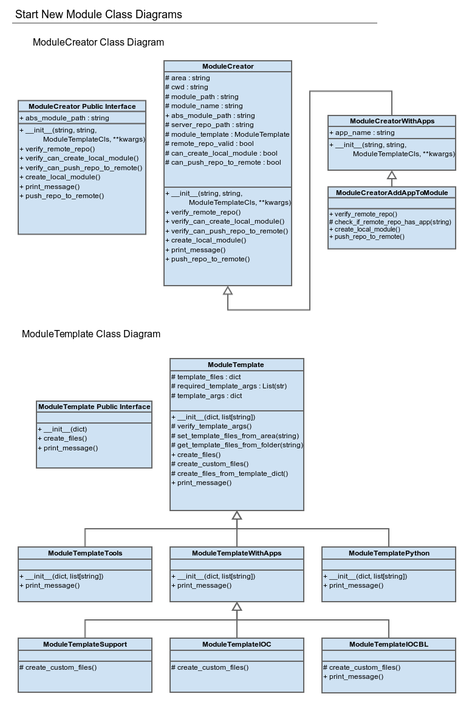

.. _start-new-module-info:

============================
Start New Module Information
============================

Contents:
---------
- :ref:`snm-info-overview`
- :ref:`snm-info-module-creator`
- :ref:`snm-info-module-template`
- :ref:`snm-info-get-module-creator-funcs`
- :ref:`snm-info-templates`
- :ref:`snm-info-system-testing`

.. _snm-info-overview:

Overview
--------
The :mod:`~dls_ade.dls_start_new_module` script uses a number of python modules
and classes, so this page is to help you understand how it all fits together.

The purpose of this script is to create a new 'module' for the controls group,
which has a name, 'area' and a few other characteristics. This module is a
single git repository, which can then be exported to the server or kept local.

First of all, outside of the utility modules that other scripts use, the
script uses 3 other python modules:

- :mod:`~dls_ade.module_creator`
    The :ref:`snm-info-module-creator` located here have the VCS-specific code.

- :mod:`~dls_ade.module_template`
    The :ref:`snm-info-module-template` located here have the 'area'-specific
    code.

- :mod:`~dls_ade.get_module_creator`
    The :ref:`snm-info-get-module-creator-funcs` located here parse given input
    and return the correct :class:`~dls_ade.module_creator.ModuleCreator` (and
    subclass) objects.

Additionally, the :ref:`snm-info-module-template` make use of a local directory
called `module_templates`, which stores a number of text files from which a
number of files in the new module are created. All 'python' and 'tools' area
modules use only these for creation. More information can be found in
:ref:`snm-info-templates`.

Finally, to make sure that the script works as intended, we have performed
complete :ref:`system-testing-info` of our finished script. More information can be
found in :ref:`system-testing-snm`.

.. _snm-info-module-creator:

ModuleCreator Classes
---------------------
Located in :mod:`~dls_ade.module_creator`.

With the interface as defined in the :ref:`snm-class-diagrams`, the
:class:`~dls_ade.module_creator.ModuleCreator` class (and subclass) objects
simplify the script's control flow.

All VCS-specific code is located here, so it primarily uses the
:mod:`~dls_ade.vcs_git` module.

All :ref:`snm-info-module-creator` require a
:class:`~dls_ade.module_template.ModuleTemplate` to be given as input; this
allows it to create a module of the correct 'area'.

.. _snm-info-module-template:

ModuleTemplate Classes
----------------------
Located in :mod:`~dls_ade.module_template`.

The :class:`~dls_ade.module_creator.ModuleCreator` class requires a
:class:`~dls_ade.module_template.ModuleTemplate` class or subclass to be passed
to it for initialisation, to handle the 'area'-specific code.

This corresponds to:

- Creating the correct folder structure and files, and
- Printing the correct message on completion of the above

The class interface and inheritance diagram can be seen in
:ref:`snm-class-diagrams`.

.. _snm-class-diagrams:

Class Diagrams
--------------

    Class diagrams and interfaces for ModuleCreator and ModuleTemplate.

.. _snm-info-get-module-creator-funcs:

get_module_creator Functions
----------------------------
Located in :mod:`~dls_ade.get_module_creator`.

These functions control the parsing of the command-line input.

They return a :class:`~dls_ade.module_creator.ModuleCreator` class or subclass
object, which is then used to perform the actual module creation.

.. _snm-info-templates:

Template Information
--------------------
The `module_templates` folder contains plain text files that are used as
templates during module creation. Here are a few things that will be useful to
know if you wish to edit these in the future:

- The use of `.py_template` instead of `.py`
    When the python package is compiled, all `.py` files are automatically
    compiled into additional `.pyc` files. To stop this, we use `.py_template`
    as a suffix instead, and :class:`~dls_ade.module_template.ModuleTemplate`
    accommodates for this.
- The use of `.keep` files
    With svn, empty folders could be stored in a repository. Unfortunately, git
    will simply ignore the empty folder, and as a result support modules
    will be created incorrectly. To avoid this, there is now a templates folder
    for support modules, and these will add a `.keep` file, allowing git to
    store the folder. There is no significance in the name `.keep`, other than
    the fact that it does not interfere with other software.
- The use of '{tag_name:s}' to input data
    Different module names, user names and paths, etc., will need to be part of
    the newly created module. As a result, we use tags of the above form to
    input this data during creation. The current list is:

    * For all:

        + module_name
            The name of the module to be created.
        + module_path
            The path to the module to be created (includes module name).
        + user_login
            The current user's login, also known as the FedID.

    * For app-based modules (support, ioc, ioc-bl (gui))

        + app_name
            The name of the app to be stored in the module.

    To escape a '{' or '}' character, simply double it up (eg. '{{}}' replaces
    '{}')

- The use of `.gitattribute` files for module contacts.
    Module contacts are stored in .gitattribute files in the module's root
    directory.
- :ref:`system-testing-info` comparison folders need to be changed after editing
    In order to ensure that the program works as intended,
    :ref:`system-testing-info` uses a number of folders that the program
    output is checked against to ensure that everything works as intended.
    Look at :ref:`snm-comparison-files-creation` to find out more.
- Where templates are set in :class:`~dls_ade.module_template.ModuleTemplate`
    The template files are set during
    :class:`~dls_ade.module_template.ModuleTemplate` initialisation. Just
    change the string to a different template folder, such as "default" or
    "python" to use those template files instead, or add a new template folder
    and set it to that.

.. _snm-info-system-testing:

System Testing
--------------
The :ref:`system-testing-info` information for :mod:`~dls_ade.dls_start_new_module`
can be found in :ref:`system-testing-snm`.